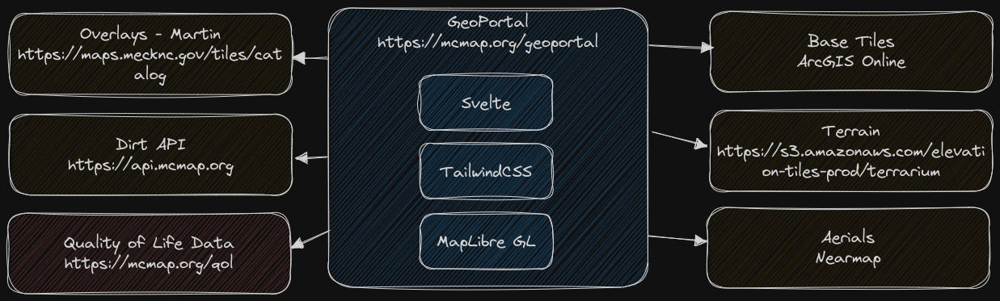

# GeoPortal v5

Mecklenburg County's main GIS portal for the public, built with [Svelte](https://svelte.dev/), [TailwindCSS](https://tailwindcss.com/), and [Maplibre GL JS](https://maplibre.org/maplibre-gl-js/docs/). The development and build environment is [Vite](https://vitejs.dev/). GeoPortal is designed for speed (perfect Lighthouse scores), ease of use, and works well on mobile devices.

Site: [https://mcmap.org/geoportal](https://mcmap.org/geoportal)

## Architecture



GeoPortal is a single page application (SPA) and progressive web app (PWA). It consumes a number of services to operate, as outlined in the architecture image.


## Using the project

[Node.js](https://nodejs.org/en) is required to run the development and build systems, and [git](https://git-scm.com/) is required to use the versioning system.

### Clone the project
```bash
git clone https://github.com/tobinbradley/Mecklenburg-County-GeoPortal.git geoportal
```

### Install dependencies
```bash
cd geoportal
npm install
```

### Start the development server
```bash
npm run dev
```

Navigate a web browser to [http://localhost:3000](http://localhost:3000) to view the HMR live development server.

### Build for production
```bash
npm run build
```

After the build is complete, copy the contents of the `dist` folder to the production web server.
